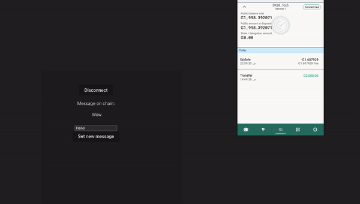

# Task 3

## My mainnet address for payout

```4f1fKZA4kT2s2knPHUJ2addLDpwH7kPe2SQQHrT8oY8yGEuji4```

## How to run the dApp

Open project directory:

```bash
cd dapp
```

Install dependencies using yarn:

```bash
yarn
```

Run app:

```bash
yarn dev
```

Then type ```http://127.0.0.1:5173/``` in browser (default vite dev address)

## What it does?

With this dApp you can save any message on chain.

- Connect your wallet to dApp


- Type new message and accept transaction


- Wait for transaction to be processed and refresh the page



