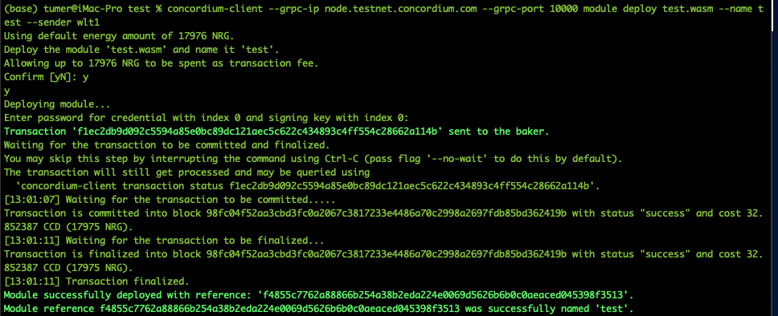
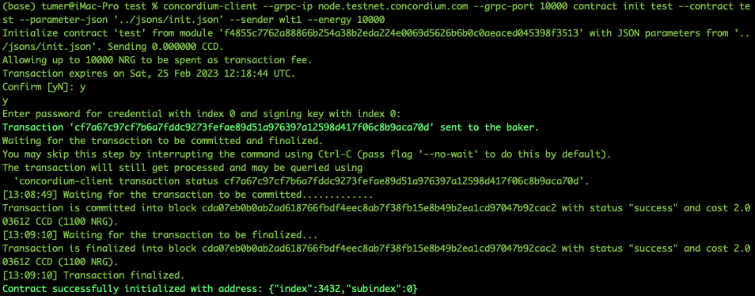
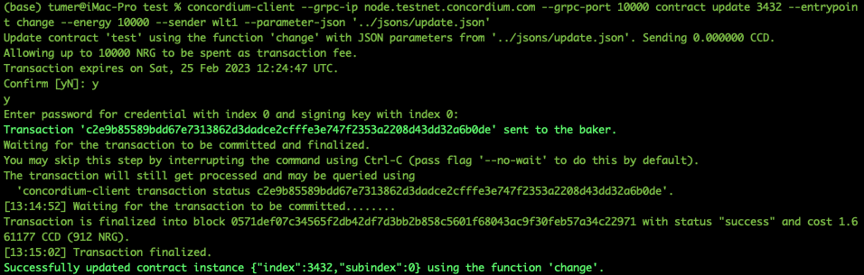
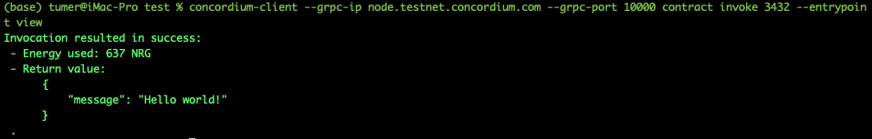

# Task 2

## My mainnet address for payout

``` 4f1fKZA4kT2s2knPHUJ2addLDpwH7kPe2SQQHrT8oY8yGEuji4 ```

## Deploying smart contract



Transaction hash

```f1ec2db9d092c5594a85e0bc89dc121aec5c622c434893c4ff554c28662a114b```

## Contract init



Transaction hash

```cf7a67c97cf7b6a7fddc9273fefae89d51a976397a12598d417f06c8b9aca70d```

JSON parameter (jsons/init.json):

```json
{
    "message": "Hello"
}
```

## Contract update



Transaction hash

```c2e9b85589bdd67e7313862d3dadce2cfffe3e747f2353a2208d43dd32a6b0de```

JSON parameter (jsons/update.json):

```json
{
    "message": "Hello world!"
}
```

## View function


